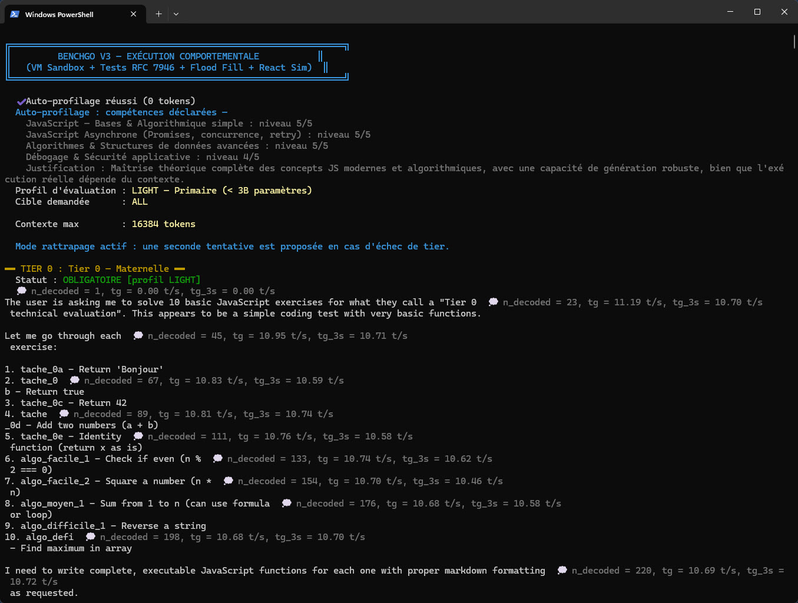
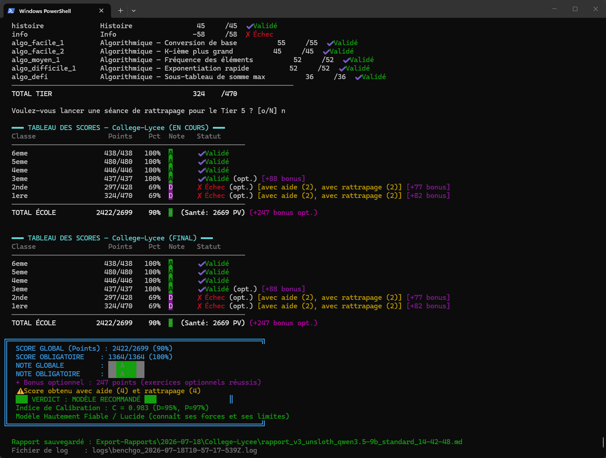
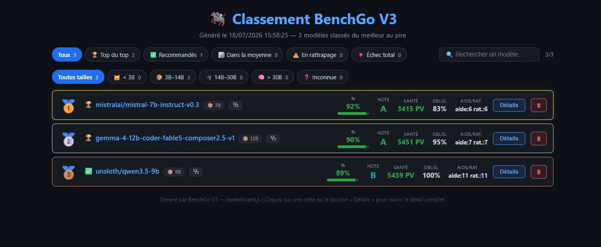
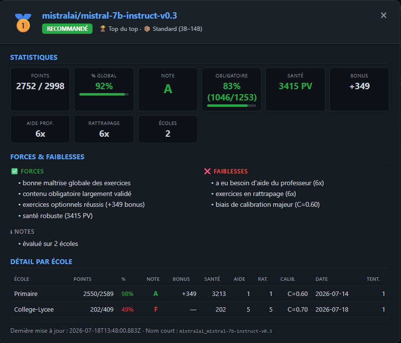

# 🏇 BenchGo V3 — Benchmark Comportemental de Modèles LLM

BenchGo V3 est un **benchmark comportemental** pour modèles de langage (LLM), locaux (via
[LM Studio](https://lmstudio.ai/)) ou cloud (OpenAI, Anthropic, Groq, Together, OpenRouter,
Mistral). Il évalue la capacité d'un modèle à **générer du code JavaScript correct** à travers
une métaphore scolaire : chaque profil est une école, chaque niveau est une classe, avec des
exercices distincts à chaque croisement.

Le benchmark s'articule autour de 5 axes : **vitesse d'inférence**, **mémoire longue**,
**optimisation d'exécution**, **robustesse aux injections** et **respect des contraintes**,
le tout dans un bac à sable VM isolé.

---

## ✨ Fonctionnalités principales

- 🎓 **Métaphore scolaire** : 5 profils = 5 écoles (Primaire → Collège/Lycée → Université → Thèse → Post-Doc), chaque tier = une classe avec ses propres exercices.
- 🧠 **Auto-profilage & calibration** : le modèle s'auto-évalue sur 4 compétences au démarrage ; les tâches trop difficiles sont filtrées ; un Indice de Calibration C = 1 − |D − P| mesure la lucidité du modèle.
- ❤️ **Santé globale (gamification)** : le modèle accumule des PV (succès) ou en perd (échecs). En dessous de −100 PV, élimination définitive (Game Over).
- 🆘 **Aide du professeur & rattrapage** : un indice peut être proposé au modèle en rattrapage ; un seul réessai par exercice (`MAX_TASK_RETRIES = 1`).
- 🎓 **Professeur IA correcteur (Free Router)** : après un échec définitif, l'élève (le modèle testé) s'auto-analyse, puis un **professeur IA indépendant** (modèle cloud via OpenRouter) relit cette analyse, dit si elle est juste/fausse et **démontre** la vraie cause racine. Rotate automatique sur les modèles gratuits d'OpenRouter (`:free`). Repli sur l'auto-analyse si aucun compte OpenRouter n'est configuré.
- 📊 **Classement global interactif** : HTML condensé avec modale de détail, filtres par catégorie de performance et par taille de modèle, recherche texte, **badge de quantification** (Q4_K_M, Q5_K_S, Q8_0...) pour chaque modèle, et **bouton « Copier le classement »** pour partager l'ensemble du classement en texte brut.
- 🧩 **Quantification des modèles** : récupérée automatiquement via l'endpoint `/api/v0/models` de LM Studio (ou saisie manuelle / flag `--quantization=`) et affichée dans le classement. Indispensable pour distinguer deux runs du même modèle avec des quantifications différentes.
- 🏫 **Écoles séquentielles** : si le modèle fait plus de 3B paramètres, BenchGo propose d'évaluer Primaire (LIGHT) puis Collège-Lycée (STANDARD) à la suite dans le même run — même clé, même auto-profilage, état de santé réinitialisé entre écoles.
- 📝 **Exports** : rapport Markdown par run, classement HTML/Markdown global, export raisonnement consolidé (destiné à NotebookLM via Gemini).
- ☁️ **Mode cloud** : 6 fournisseurs supportés (OpenAI, Anthropic, Groq, Together, OpenRouter, Mistral).
- 🧪 **Évaluateurs custom asynchrones** : Promise.allSettled, retry/backoff, concurrence limitée, middleware Cloudflare, etc.

---

## 📥 Installation (pas-à-pas, pour débutants)

BenchGo V3 est une application en ligne de commande (CLI) qui s'exécute dans un terminal.
Pas besoin de navigateur ni d'interface graphique : tout se passe dans PowerShell
(Windows), Terminal (macOS) ou bash (Linux).

### Étape 1 — Installer Node.js (obligatoire)

BenchGo est un programme JavaScript qui a besoin de **Node.js version 18 ou supérieure**
pour s'exécuter.

1. Allez sur https://nodejs.org/
2. Téléchargez la version **LTS** (recommandée) pour votre système.
3. Installez-la avec les options par défaut (Suivant → Suivant → Terminer).
4. Vérifiez l'installation dans un terminal :

   ```powershell
   node --version
   ```
   Doit afficher `v18.x.x` ou plus (ex : `v20.18.0`).

### Étape 2 — Télécharger BenchGo V3

Trois méthodes possibles, de la plus simple à la plus « pro ».

#### Méthode A — Télécharger un ZIP (le plus simple, sans Git)

1. Ouvrez la page GitHub du projet : https://github.com/cisco-03/benchgo
2. Cliquez sur le bouton vert **« <> Code »** en haut à droite.
3. Choisissez **« Download ZIP »**.
4. Extrayez l'archive (`benchgo-main.zip`) où vous le souhaitez, par exemple dans
   `C:\Users\votre-nome\Desktop\` → dossier `benchgo-main`.
5. Ouvrez un terminal **dans ce dossier** :
   - Windows : clic droit dans le dossier → « Ouvrir dans le terminal »
   - ou : PowerShell, puis `cd Chemin\Vers\benchgo-main`

#### Méthode B — Cloner avec Git (recommandé pour recevoir les mises à jour)

Si vous avez [Git](https://git-scm.com/) installé :

```powershell
git clone https://github.com/cisco-03/benchgo.git
cd benchgo
```

Pour récupérer les mises à jour plus tard, il suffira de :

```powershell
git pull
```

#### Méthode C — Via GitHub CLI

Si vous utilisez [GitHub CLI](https://cli.github.com/) :

```powershell
gh repo clone cisco-03/benchgo
cd benchgo
```

### Étape 3 — Aucune installation de dépendances

BenchGo n'utilise **que des modules intégrés à Node.js** (`fs`, `http`, `vm`, `crypto`…).
Il n'y a **pas de `npm install` à lancer**. Une fois le dossier téléchargé et Node.js
présent, l'application est prête.

### Étape 4 — Préparer un modèle à évaluer

Vous avez deux options :

- **Modèle local** : installez [LM Studio](https://lmstudio.ai/), chargez un modèle
  (GGUF), puis démarrez le **serveur local** de LM Studio (icône serveur → « Start
  Server »). L'API écoute par défaut sur `http://localhost:1234`.
- **Modèle cloud** : créez un compte chez un fournisseur (OpenAI, Anthropic, Groq,
  OpenRouter…) et récupérez une clé API.

### Étape 5 — Lancer le premier benchmark

```powershell
node runner.js all
```

L'application détecte automatiquement la taille du modèle chargé dans LM Studio et
choisit le profil adapté (LIGHT / STANDARD / EXPERT…). Le résultat s'affiche dans le
terminal ; un rapport Markdown est généré dans `Export-Rapports/`.

> 📖 Pour le détail des commandes et options, consultez le
> [Manuel utilisateur](./Docs/Manuel-utilisateur/README.md).

---

## 🚀 Démarrage rapide (récapitulatif)

```bash
# Mode local (LM Studio) — détection auto du profil selon la taille du modèle
node runner.js all

# Forcer un profil
node runner.js all --profile=LIGHT      # < 3B
node runner.js all --profile=STANDARD   # 3B – 14B
node runner.js all --profile=EXPERT     # 14B – 30B
```

### Mode cloud

```bash
# OpenAI
$env:OPENAI_API_KEY = "sk-..."
node runner.js all --provider=openai --model=gpt-4o

# Anthropic
$env:ANTHROPIC_API_KEY = "sk-ant-..."
node runner.js all --provider=anthropic --model=claude-opus-4-5

# Groq (gratuit, très rapide)
$env:GROQ_API_KEY = "gsk_..."
node runner.js all --provider=groq --model=llama-3.1-70b-versatile

# OpenRouter (accès universel)
$env:OPENROUTER_API_KEY = "sk-or-..."
node runner.js all --provider=openrouter --model=anthropic/claude-opus-4 --profile=FRONTIER
```

### Gérer le classement

```bash
# Régénérer les 3 fichiers de classement (HTML + MD + raisonnement)
node leaderboard.js

# Mode interactif (serveur web sur http://localhost:3939, boutons de suppression actifs)
node leaderboard.js --serve
```

---

## 🏫 Architecture scolaire

| Profil | École | Taille modèle | Tiers obligatoires | Tiers optionnels |
|---|---|---|---|---|
| LIGHT | 🏫 Primaire | < 3B | 0, 1 | 2, 3, 4, 5 |
| STANDARD | 🏫 Collège/Lycée | 3B – 14B | 0, 1, 2 | 3, 4, 5, 6 |
| EXPERT | 🎓 Université | 14B – 30B | 0, 1, 2, 3 | 6 |
| DOCTORAT | 🔬 Thèse | > 30B | 0, 1, 2, 3, 6 | — |
| FRONTIER | 🔬 Post-Doc | Cloud | 0, 1, 2, 3, 4, 6 | — |

Chaque croisement (profil × tier) possède ses propres exercices dans `tiers/tier{N}_{profile}.json`,
avec une chaîne de fallback automatique (`FRONTIER → DOCTORAT → EXPERT → STANDARD → LIGHT`).

### Axes d'évaluation (Tier 6 — Expertise & Résistance)
1. **Vitesse d'inférence** — chronométrage du temps de génération de l'API
2. **Mémoire longue** — retrouver une « aiguille » au milieu d'un long texte
3. **Optimisation VM** — limite de temps d'exécution stricte (ex : 35 ms)
4. **Robustesse injection** — immunité face à des ordres contraires injectés
5. **Respect des contraintes** — interdiction de certaines instructions (ex : tri sans `.sort()`)

---

## 📊 Classement interactif (Leaderboard)

Le classement HTML (généré dans `Export-Rapports/classement.html`) est **condensé et interactif** :

- **Cartes condensées** : une ligne par modèle avec rang, nom, badge de catégorie, badge de taille (ex : `📦 7B`), et mini-stats (% avec barre, Note, Santé, Obligatoire, Aide/Rattrapage).
- **Modale de détail** : clic sur une carte ou sur « Détails » → ouvre une modale avec statistiques complètes, forces/faiblesses, tableau détaillé par école (avec calibration), et métadonnées.
- **Historique des re-tests** : le carnet de scores cumule toutes les tentatives par école. Dans la modale, une école ayant subi plusieurs tests affiche un toggle dépliable listant l'historique chronologique (la meilleure tentative est marquée ★). Idéal pour suivre l'évolution d'un modèle après une mise à jour du créateur. Le classement global reste basé sur la meilleure tentative.
- **Filtres par catégorie** : 🏆 Top du top (≥90%) · ✅ Recommandés (≥80%) · 📊 Dans la moyenne (≥70%) · ⚠️ En rattrapage (≥50%) · 💥 Échec total (<50%).
- **Filtres par taille de paramètres** : 🐱 < 3B · 📦 3B–14B · 🎓 14B–30B · 🧠 > 30B · ❓ Inconnue.
- **Recherche texte** : par nom de modèle. Combinable avec les filtres (ET logique).
- **Fichier autonome** : CSS + JS embarqués, ouvrable hors-ligne en double-clic, aucune dépendance externe.

### Exports produits (racine de `Export-Rapports/`)
| Fichier | Description |
|---|---|
| `classement.html` | Classement visuel interactif (condensé + modale + filtres) |
| `classement.md` | Classement Markdown tabulaire + détail par modèle |
| `raisonnement_modeles.md` | Raisonnements & réponses détaillés par modèle (destiné à NotebookLM via Gemini) |

### Rapports datés par école et par jour

Chaque exécution de `runner.js` produit aussi un **rapport individuel horodaté**,
classé par date puis par école :

```
Export-Rapports/
└── <AAAA-MM-JJ>/
    ├── Primaire/
    │   └── rapport_v3_<modèle>_<profil>_<HH-MM-SS>.md
    └── College-Lycee/
        └── rapport_v3_<modèle>_<profil>_<HH-MM-SS>.md
```

Ces rapports contiennent le **détail complet d'un run** (exercice par exercice,
réponse du modèle, raisonnement, points obtenus/max, statut). Ils ne sont pas
écrasés : un nouveau fichier est créé à chaque run, ce qui permet de constituer
un **historique** des performances d'un modèle dans le temps.

> 💡 **Workflow d'analyse qualitatif** : ces rapports datés sont conçus pour être
> transmis à **Gemini**, qui en produit une synthèse ; cette synthèse est ensuite
> injectée dans un carnet **NotebookLM** partagé pour interroger librement les
> résultats par modèle, par exercice ou par école :
> 👉 [Carnet NotebookLM BenchGo V3](https://notebooklm.google.com/notebook/bd6cf971-b22a-460a-9892-419d1db02f9e)

---

## 🧩 Modules

| Module | Rôle |
|---|---|
| `runner.js` | Orchestrateur principal (routing Local/Cloud, auto-profilage, calibration, gamification) |
| `config.js` | Configuration centralisée (profils, CLI args, détection de profil, `selfProfiling`) |
| `self-profiling.js` | Auto-profilage du modèle + filtrage dynamique des tâches |
| `lm-studio-client.js` | Client API LM Studio (streaming SSE, budget contexte) |
| `cloud-client.js` | Client API cloud (6 fournisseurs, OpenAI-compat + Anthropic natif) |
| `teacher-client.js` | Professeur IA correcteur (OpenRouter Free Router, rotation sur modèles gratuits) |
| `tier-loader.js` | Chargement des tiers JSON par profil (fallback chain) |
| `task-evaluator.js` | Moteur d'évaluation des tâches (exec/pattern/custom) |
| `custom-evaluators.js` | Évaluateurs comportementaux spécialisés (async, sécurité, algos) |
| `vm-sandbox.js` | Bac à sable VM isolé (`setTimeout`/`clearTimeout` inclus) |
| `parsing-utils.js` | Extraction JSON/regex + stripping TypeScript |
| `score-ledger.js` | Carnet de scores persistant + calcul de calibration |
| `report-generator.js` | Génération des rapports Markdown |
| `leaderboard.js` | Classement global (HTML condensé + modale + filtres, MD, raisonnement) |
| `progress-bar.js` | UI console (ProgressBar, Spinner, `letterGrade`) |
| `logger.js` | Journalisation dans `logs/` |

---

## 📁 Structure du projet

```
benchmark-v3/
├── runner.js                  ← Orchestrateur principal
├── config.js                  ← Configuration & profils
├── leaderboard.js             ← Classement global (HTML + MD + raisonnement)
├── self-profiling.js          ← Auto-profilage & calibration
├── score-ledger.js            ← Carnet de scores persistant
├── cloud-client.js            ← Client API cloud (6 fournisseurs)
├── teacher-client.js           ← Professeur IA correcteur (OpenRouter Free Router)
├── lm-studio-client.js        ← Client API LM Studio
├── tier-loader.js             ← Chargement des tiers par profil
├── task-evaluator.js          ← Moteur d'évaluation
├── custom-evaluators.js       ← Évaluateurs spécialisés
├── vm-sandbox.js              ← Bac à sable VM
├── parsing-utils.js           ← Parsing & stripping TypeScript
├── report-generator.js        ← Génération rapports Markdown
├── progress-bar.js            ← UI console
├── logger.js                  ← Journalisation
├── tiers/                     ← 16 fichiers JSON d'exercices (par profil × tier)
├── Docs/                      ← Documentation utilisateur (Manuel, CHANGELOG, gamification)
└── Export-Rapports/           ← Rapports générés (gitignored)
    ├── .carnet/<modele>.json  ← Carnets de scores persistants
    ├── classement.html        ← Classement interactif
    ├── classement.md          ← Classement Markdown
    └── raisonnement_modeles.md ← Export raisonnement (NotebookLM)
```

---

## 📖 Documentation

- [Manuel utilisateur](./Docs/Manuel-utilisateur/README.md) — Démarrage, commandes, fonctionnement, lecture des résultats, dépannage, référence des tiers
- [CHANGELOG](./Docs/CHANGELOG.md) — Historique chronologique des modifications
- [Système de gamification & santé](./Docs/Apps-Fonctions/gamification-sante.md) — Fonctionnement des PV, pénalités et élimination

---

## ⚙️ Options CLI

| Option | Description |
|---|---|
| `all` ou `N` | Lance tous les tiers ou un tier spécifique (0-6) |
| `--profile=<PROFIL>` | Force le profil (LIGHT / STANDARD / EXPERT / DOCTORAT / FRONTIER) |
| `--context-limit=<N>` | Limite de tokens de contexte (défaut : 16384) |
| `--provider=<NOM>` | Mode cloud (openai / anthropic / groq / together / openrouter / mistral) |
| `--model=<NOM>` | Nom du modèle cloud |
| `--api-key=<CLÉ>` | Clé API cloud (⚠️ visible dans le terminal — préférer les variables d'env) |
| `--teacher-model=<NOM>` | Modèle du professeur correcteur (défaut : `meta-llama/llama-3.3-70b-instruct:free`) |
| `--teacher-api-key=<CLÉ>` | Clé API OpenRouter pour le professeur (force le mode professeur sans interaction) |
| `--teacher-endpoint=<URL>` | Endpoint alternatif pour le professeur (avancé) |
| `--no-teacher` | Désactive le professeur IA (repli sur l'auto-analyse classique de l'élève) |
| `--quantization=<Q>` | Quantification du modèle (ex: `Q4_K_M`, `Q5_K_S`, `Q8_0`). Auto-détectée via LM Studio `/api/v0/models` si absente ; saisie manuelle demandée au questionnaire pour Ollama/custom. |

---

## 🖼️ Galerie

Aperçu de l'interface console et des exports produits par BenchGo V3.

<table>
  <tr>
    <td width="50%" align="center"><b>Auto-profilage & début d'exercice</b></td>
    <td width="50%" align="center"><b>Résultats des tests & points par LLM</b></td>
  </tr>
  <tr>
    <td width="50%" align="center"></td>
    <td width="50%" align="center"></td>
  </tr>
  <tr>
    <td width="50%" align="center"><b>Classement global des modèles</b></td>
    <td width="50%" align="center"><b>Modale de détail — résultats par école</b></td>
  </tr>
  <tr>
    <td width="50%" align="center"></td>
    <td width="50%" align="center"></td>
  </tr>
</table>

---

## 📜 Licence

Ce projet est distribué sous licence **MIT**. Voir le fichier [`LICENSE`](./LICENSE).

En résumé : vous êtes libre d'utiliser, copier, modifier, fusionner, publier,
distribuer et même commercialiser BenchGo V3, à condition de conserver la
mention de copyright et la notice de licence. Le logiciel est fourni « tel quel »,
sans aucune garantie.

---

## 🤝 Contribuer

Les contributions sont les bienvenues ! Avant de proposer une modification,
lisez le guide [`CONTRIBUTING.md`](./.github/CONTRIBUTING.md).

Le flux standard est le suivant :

1. **Forkez** le dépôt sur GitHub.
2. Créez une branche : `git checkout -b ma-feature`.
3. Commitez vos changements avec un message clair.
4. Poussez : `git push origin ma-feature`.
5. Ouvrez une **Pull Request** depuis votre fork vers la branche `main`.

Toutes les PR passent par une revue avant fusion — vous gardez ainsi la maîtrise
du projet. Voir aussi le [Code de conduite](./.github/CODE_OF_CONDUCT.md).

---

**BenchGo V3** — *Si ce n'est pas documenté, ça n'a pas été fait.* 🏇